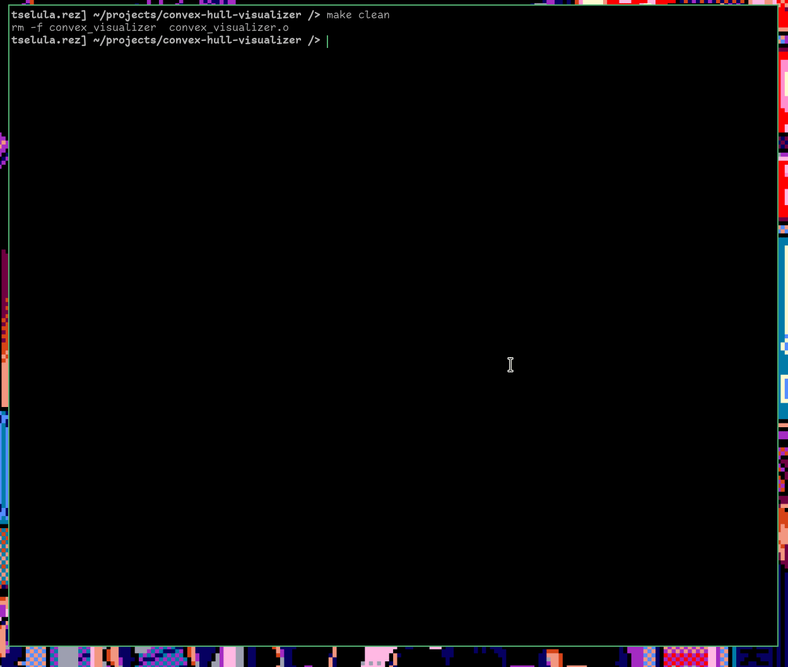

## BUILDING
To build you will need to install ncurses-dev. On debian systems you may use: sudo apt install libncurses-dev
Finally, simply run make.

## USAGE

Arrow keys to move between buttons. Enter to select choice. Backspace to go to previous screen.

Interactive is a mode where you can move around, place points, rewind, fast forward...

Benchmark simply runs the algorithms on 5 sets of input files. For each input file each algo is ran several times to generate an average. Finally, all 5 averages averaged to one final value.

